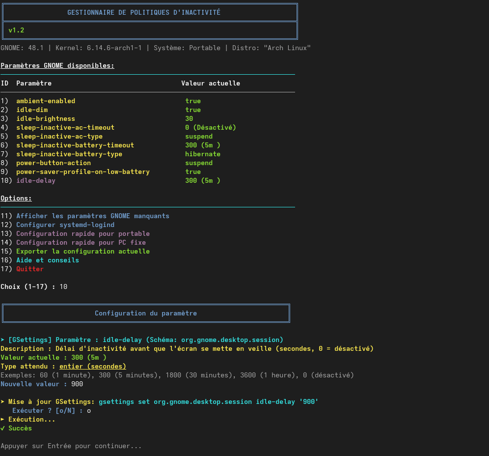
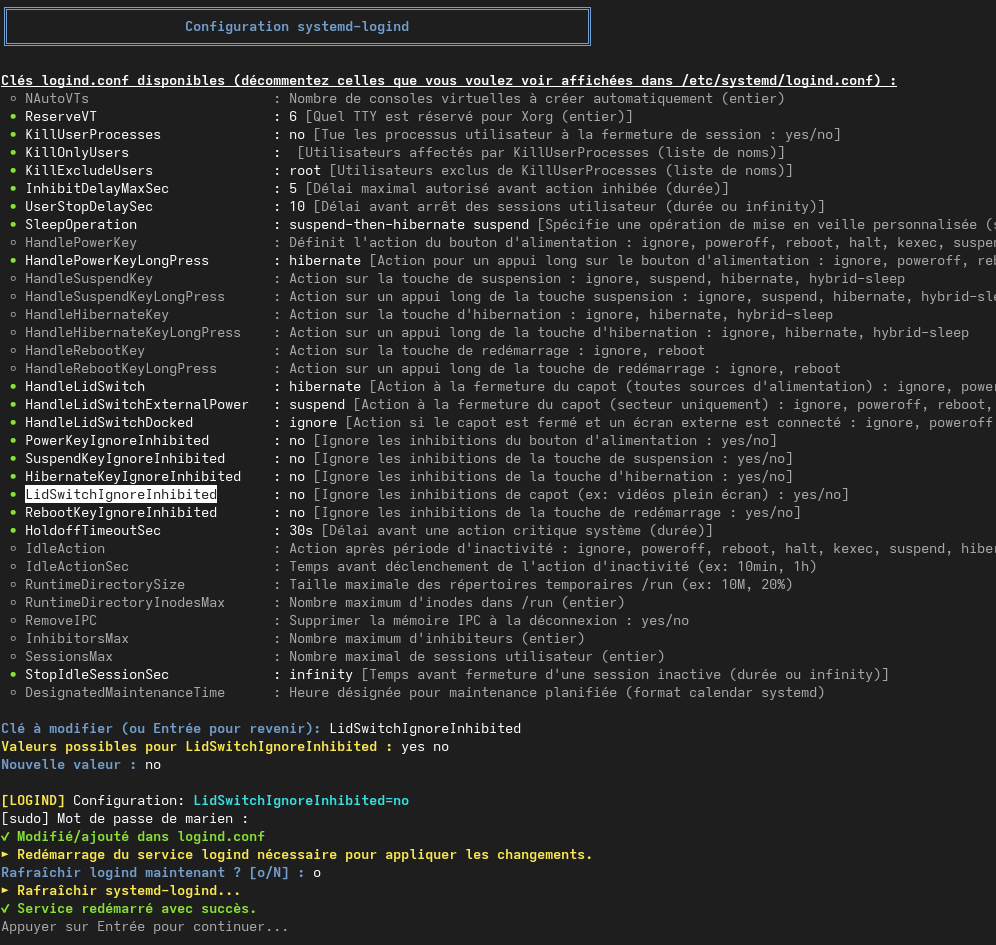

# PowerPolicyManager
An interactive manager for inactivity and power-saving policies for Linux systems, allowing quick and easy configuration of sleep, hibernation, and power management behaviors. I designed it for Archlinux to simplify my life, but it should work with any gnome+systemd environment I think.

⚠️ For optimal functionality, ensure that no other power management tools are running that might interfere with these settings.


## 📋 Features
- ⚡ Complete configuration of GNOME power-saving settings
- 🔄 Management of behaviors on battery and when plugged in
- 💤 Configuration of actions when closing the laptop lid
- ⏱️ Setting sleep delay timers
- 🛠️ Configuration of systemd-logind (power button actions, etc.)
- 📱 Preconfigured profiles for laptops and desktop PCs
- 📤 Export configurations for backup or sharing

## 🖼️ Screenshots



## 🚀 Installation
### Simple method
```bash
# Download the script
wget https://raw.githubusercontent.com/crocodile13/InactiMate_Advanced-Gnome-power-manager/main/define-inactivity-policie.sh
# Make the script executable
chmod +x power-policy-manager.sh
# Run the script
./power-policy-manager.sh
```

### From source
```bash
# Clone the repository
git clone https://github.com/crocodile13/InactiMate_Advanced-Gnome-power-manager.git
# Enter the directory
cd PowerPolicyManager
# Make the script executable
chmod +x power-policy-manager.sh
# Run the script
./power-policy-manager.sh
```

## 📝 Prerequisites
- A Linux system with GNOME and systemd (it could work with just gnome or just systemd i did't try)
- The `gsettings-desktop-schemas` or `gnome-settings-daemon` package
- Sudo rights to modify systemd-logind settings

## 🔧 Usage
The interface is fully interactive and guided. After launching the script, you can:
1. Browse the settings available on your system
2. Individually modify each setting
3. Apply predefined configurations (laptop or desktop PC)
4. View configuration tips adapted to your hardware
5. Export your current configuration

## 📚 Configurable Settings
### GNOME Settings
- Sleep delay timers (when plugged in and on battery)
- Actions after inactivity (sleep, hibernation, shutdown...)
- Behavior when closing the laptop lid
- Screen dimming during inactivity
- Power-saving profile on low battery
- [...]

### systemd-logind Settings
- Actions when pressing the power button
- Actions when closing the laptop lid (with or without external screen)
- Actions after prolonged inactivity
- Behavior of sleep/hibernation keys
- [...]

## 🔄 GNOME vs logind — Who controls what?

GNOME acts as a higher-level layer above `systemd-logind`, intercepting and managing most power-related events (inactivity, power button, lid close, etc.).  
This means that **within a GNOME session**, its own settings (`gsettings`) **take precedence** over those of `logind`.

> Conversely, **outside of GNOME** (tty, Wayland session without gnome-settings-daemon, etc.), **logind** takes over.

PowerPolicyManager lets you configure **both layers**, including settings **not exposed by the GNOME interface**, giving you full control over power management.

## 🤝 Contribution
Contributions are welcome if you want!

## 🙏 Acknowledgements
AI lol! (Claude 3.7 Sonnet and GPT4o) was a great help as you probably see from the code, it gets the job done...
